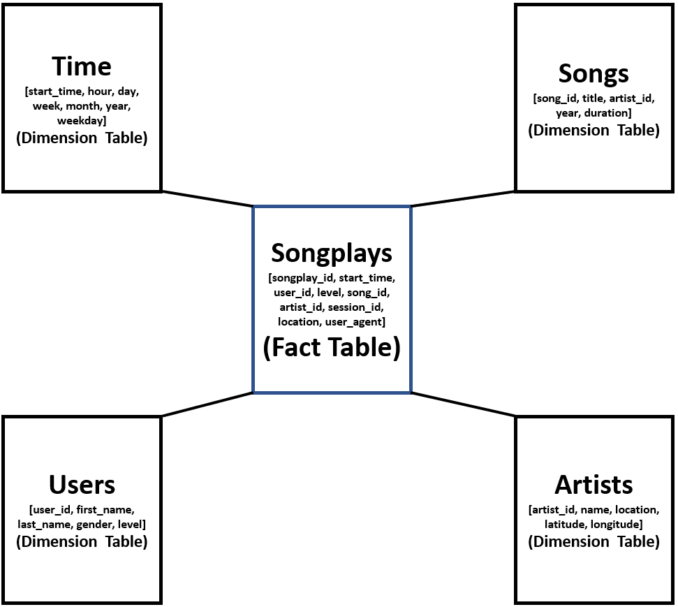

# Data-Modeling-with-Postgres

In this project, we model data Postgres and create a Postgres database with tables designed to optimize queries on song play analysis. Using the song and log datasets, we create a star schema for queries on song play analysis. This includes the following tables:

## Fact Table
songplays table contains records in log data associated with song plays i.e. records with page NextSong. The columns include:

* songplay_id, start_time, user_id, level, song_id, artist_id, session_id, location, user_agent

## Dimension Tables

There are four dimension tables as follows:

* users - users in the app with the following columns:
user_id, first_name, last_name, gender, level
* songs - songs in music database with the following columns:
song_id, title, artist_id, year, duration
* artists - artists in music database with the following columns:
artist_id, name, location, latitude, longitude
* time - timestamps of records in songplays broken down into specific units with the following columns:
start_time, hour, day, week, month, year, weekday

The columns of these tables are extracted from song data and activity-logs data and after applying appropriate processing that are explaine d in the "etl.ipynb". 

The "etl.py" interates over all files to create and load data into the tables.

The "sql_queries.py" defines the required queries, including DROP table queries, CREATE tables queries and INSERT queries.

The "create_tables.py" uses the queries to create the database and drop and create tables.

In this project, we need to first run the "sql_queries.py" in terminal and then "create_tables.py" in the terminal. After that we can run "etl.ipynb" and next we can run "etl.py" in terminal, again. At the end we can run the "test.ipynb".